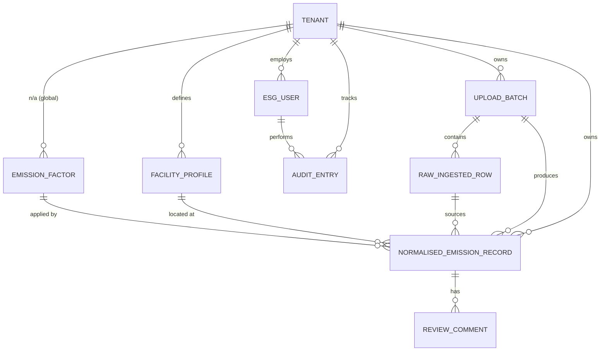

# MODEL.md: Database Schema & Design Rationale

This document details the database architecture for the Breathe ESG platform. The model has been upgraded from a prototype structure to a production-ready design supporting multi-tenancy, immutable provenance, versioned emission factors, and a formal review workflow state machine.

---

## 1. Entity Relationship Overview



---

## 2. Table Schemas & Fields

### A. `tenants.Tenant` → DB table: `org_tenant`
Root boundary for multi-tenant data isolation. Every row in the system is scoped to exactly one Tenant.

| Field | Type | Notes |
|---|---|---|
| `id` | UUID PK | Auto-generated |
| `name` | CharField(255) | Unique |
| `slug` | SlugField(100) | Unique — used in API routes |
| `country` | CharField(100) | Optional |
| `industry` | CharField(50) | `Industry` choices (Manufacturing, Energy, Financial, etc.) |
| `active_reporting_year` | PositiveSmallIntegerField | Current working year |
| `is_active` | BooleanField | Soft-disable tenants |
| `created_at` | DateTimeField | Auto |

### B. `tenants.ESGUser` → DB table: `org_esg_user`
Custom user model (`AUTH_USER_MODEL`). Email is the login key. Scoped to a tenant.

| Field | Type | Notes |
|---|---|---|
| `id` | UUID PK | |
| `tenant` | FK → Tenant | `PROTECT`, nullable for superusers |
| `email` | EmailField | Unique — `USERNAME_FIELD` |
| `full_name` | CharField(255) | |
| `role` | CharField | `ADMIN`, `ANALYST`, `AUDITOR` |
| `is_active` / `is_staff` | BooleanField | Django auth flags |

**Index:** `(tenant, role)`

---

### C. `ingestion.UploadBatch` → DB table: `esg_upload_batch`
One ingestion event from one external system. Immutable after `COMPLETED`.

| Field | Type | Notes |
|---|---|---|
| `id` | UUID PK | |
| `tenant` | FK → Tenant | `PROTECT` |
| `source_type` | CharField | `SAP`, `UTILITY`, `TRAVEL` |
| `name` | CharField(255) | Human label (defaults to filename) |
| `external_ref` | CharField(255) | Original filename or API batch ID |
| `status` | CharField | `PENDING`, `PROCESSING`, `COMPLETED`, `FAILED` |
| `reporting_year` | PositiveSmallIntegerField | e.g. `2024` |
| `uploaded_by` | FK → ESGUser | `SET_NULL` |
| `uploaded_at` | DateTimeField | Auto |
| `row_count` | PositiveIntegerField | |
| `error_summary` | JSONField | Pipeline-level errors |

**Indexes:** `(tenant, source_type, reporting_year)`, `(status)`

### D. `ingestion.RawIngestedRow` → DB table: `esg_raw_row`
**Immutable.** Stores data exactly as received. Never updated or deleted after creation.

| Field | Type | Notes |
|---|---|---|
| `id` | UUID PK | |
| `tenant` | FK → Tenant | `PROTECT` |
| `batch` | FK → UploadBatch | `PROTECT` |
| `raw_payload` | JSONField | Unmodified source data |
| `source_row_index` | PositiveIntegerField | File line number |
| `checksum` | CharField(64) | SHA-256 of `raw_payload` for duplicate detection |
| `received_at` | DateTimeField | Auto |

**Constraint:** `UNIQUE(batch, checksum)` — rejects exact duplicate re-ingestion  
**Indexes:** `(tenant, batch)`, `(checksum)`

---

### E. `emissions.FacilityProfile` → DB table: `esg_facility_profile`
Reference data: a named physical or logical location owned by a tenant.

| Field | Type | Notes |
|---|---|---|
| `id` | UUID PK | |
| `tenant` | FK → Tenant | `PROTECT` |
| `code` | CharField(100) | System-of-record code (e.g. SAP `WERKS`) |
| `name` | CharField(255) | Human-readable name |
| `address` | CharField(500) | Optional |
| `country` | CharField(100) | Optional |
| `is_active` | BooleanField | |

**Constraint:** `UNIQUE(tenant, code)`  
**Index:** `(tenant, is_active)`

### F. `emissions.EmissionFactor` → DB table: `esg_emission_factor`
Versioned conversion factor library. Factors are pinned to reporting years so historical calculations remain reproducible when DEFRA/EPA publish updates.

| Field | Type | Notes |
|---|---|---|
| `id` | UUID PK | |
| `name` | CharField(255) | e.g. `UK Grid Electricity 2024` |
| `source` | CharField(255) | e.g. `DEFRA 2024` |
| `scope` | CharField | `SCOPE_1`, `SCOPE_2`, `SCOPE_3` |
| `activity` | CharField(150) | e.g. `Stationary Combustion` |
| `unit_from` | CharField(50) | Input unit |
| `factor_value` | Decimal(20,10) | **kg CO₂e per `unit_from`** |
| `valid_from` / `valid_to` | PositiveSmallIntegerField | Reporting year range |

**Index:** `(scope, activity, valid_from)`

### G. `emissions.NormalisedEmissionRecord` → DB table: `esg_emission_record`
Central business model. One record = one normalised GHG entry for one period and one scope.

| Group | Fields |
|---|---|
| **Provenance** | `tenant`, `batch`, `raw_row` (FK → RawIngestedRow), `reporting_year` |
| **Facility & period** | `facility` (FK → FacilityProfile, nullable), `facility_label`, `period_start`, `period_end` |
| **Classification** | `source_type`, `scope` (SCOPE_1/2/3), `category`, `activity_type` |
| **Raw quantity** | `quantity_raw`, `unit_raw` |
| **Normalised quantity** | `quantity_normalised`, `unit_normalised` |
| **GHG calculation** | `emission_factor` (value), `emission_factor_ref` (FK → EmissionFactor), `co2e_kg` (always kg) |
| **Quality** | `confidence_score` (0–100), `anomaly_flag`, `anomaly_reason` |
| **Review workflow** | `review_status`, `reviewed_by`, `reviewed_at`, `review_notes` |
| **Audit lock** | `locked_at`, `locked_by` |

**Constraints:**
- `UNIQUE(raw_row, scope, period_start)` — prevents double-counting; period_start included so utility billing rows can produce one record per calendar month
- `CHECK(period_end >= period_start)`
- `CHECK(confidence_score BETWEEN 0 AND 100)`
- `CHECK(co2e_kg >= 0)`

**Indexes:** `(tenant, reporting_year, scope)`, `(tenant, review_status)`, `(tenant, source_type, reporting_year)`, `(anomaly_flag)`, `(period_start, period_end)`

---

### H. `reviews.AuditEntry` → DB table: `esg_audit_entry`
Append-only log of every meaningful change to any ESG object.

| Field | Type | Notes |
|---|---|---|
| `id` | UUID PK | |
| `tenant` | FK → Tenant | `PROTECT` |
| `object_type` | CharField(100) | e.g. `NormalisedEmissionRecord` |
| `object_id` | UUIDField | PK of changed object (no FK — generic) |
| `action` | CharField(50) | e.g. `STATUS_CHANGE`, `FIELD_EDIT`, `LOCK` |
| `performed_by` | FK → ESGUser | `SET_NULL` |
| `performed_at` | DateTimeField | Indexed |
| `field_name` | CharField(100) | Empty for multi-field actions |
| `before_value` / `after_value` | JSONField | Delta snapshot |
| `note` | TextField | Analyst rationale |

**Indexes:** `(object_type, object_id)`, `(tenant, performed_at)`, `(performed_by)`

### I. `reviews.ReviewComment` → DB table: `esg_review_comment`
Mutable threaded analyst comment. Separate from the immutable `AuditEntry` trail.

| Field | Type | Notes |
|---|---|---|
| `id` | UUID PK | |
| `tenant` | FK → Tenant | |
| `record` | FK → NormalisedEmissionRecord | CASCADE |
| `author` | FK → ESGUser | `SET_NULL` |
| `body` | TextField | |
| `is_resolved` | BooleanField | Thread closed flag |
| `created_at` / `updated_at` | DateTimeField | Auto |

---

## 3. Review Status State Machine

```
┌──────────────┐
│ NEEDS_REVIEW │◄──────────────────────┐
└──────┬───────┘                       │
       │ confidence ≥ 80               │ analyst resets
       ▼                               │
┌────────────────┐                     │
│  AUTO_APPROVED │                     │
└──────┬─────────┘                     │
       │ analyst override              │
       ▼                               │
  ┌──────────┐      ┌──────────┐       │
  │ APPROVED │      │ REJECTED │───────┘
  └────┬─────┘      └──────────┘
       │ admin locks
       ▼
  ┌──────────┐
  │  LOCKED  │  ← terminal state, enforced in save()
  └──────────┘
```

---

## 4. Key Design Rationale

### A. Strict Multi-Tenancy
Every table carries a `tenant` FK. All queries filter on `tenant_id` at the DB index level — data leakage across tenants is architecturally impossible.

### B. Raw Ingestion Immutability (The Ledger Principle)
`RawIngestedRow` is never updated or deleted. Its SHA-256 checksum enforces uniqueness. This allows:
- Re-deriving emissions retrospectively when emission factors change
- Regulators to verify the normalization engine never fabricated or omitted values

### C. `co2e_kg` Always in Kilograms
All normalised records store GHG impact in **kg CO₂e** regardless of scope. This allows safe cross-scope aggregation without unit conversion at query time.

### D. Versioned `EmissionFactor` Table
Rather than hardcoding factors in parsers, a dedicated `EmissionFactor` model records the factor value, its source authority (DEFRA/EPA), and the valid year range. Past calculations are reproducible even after new factors are published.

### E. `on_delete=PROTECT` Throughout
Prevents accidental cascade deletes of compliance data. Explicit cleanup of child records is required before a parent can be removed — this is intentional friction for audit safety.

### F. Generic Audit Log
`AuditEntry` uses `(object_type, object_id)` instead of hard foreign keys. One table logs changes to any model without schema coupling — the trade-off is no referential integrity enforcement on `object_id`.

---

## 5. Backwards-Compatible Aliases (Transitional)

To avoid breaking existing parsers and views during the migration, the following aliases are defined:

```python
# ingestion/models.py
RawIngestedData = RawIngestedRow          # old name

# emissions/models.py
FacilityLookup   = FacilityProfile        # old name
NormalizedRecord = NormalisedEmissionRecord  # old name

# reviews/models.py
AuditTrail = AuditEntry                   # old name
```

> These aliases will be removed once all consumer code is updated to the canonical names.
