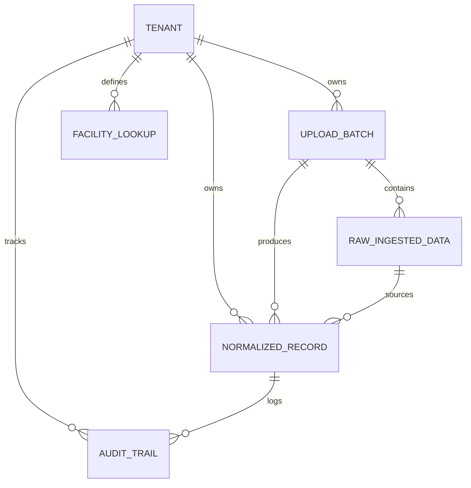

# MODEL.md: Database Schema & Design Rationale

This document details the database architecture designed for the Breathe ESG prototype, explaining the modeling choices made to satisfy strict auditability, multi-tenancy, and compliance constraints in carbon accounting.

---

## 1. Entity Relationship Overview

The database is normalized to preserve raw inputs (provenance/lineage) while generating standardized, calendar-aligned carbon entries.

---

## 2. Table Schemas & Fields

### A. `tenants.Tenant`
Provides absolute structural separation at the schema/query level for multi-tenant SaaS deployment.
* **`id`** (`UUID`, Primary Key): Secure, non-sequential identifier protecting against ID enumeration attacks.
* **`name`** (`CharField(255)`, Unique): Human-readable company/tenant name.
* **`created_at`** (`DateTimeField`): Auto-timestamp for tenant onboarding.

### B. `emissions.FacilityLookup`
A mapping table that translates messy, uninformative legacy enterprise identifiers into human-readable facility profiles.
* **`id`** (`UUID`, Primary Key)
* **`tenant`** (`ForeignKey -> Tenant`): Ensures Tenant A cannot see or hijack Tenant B's plant mapping rules.
* **`code`** (`CharField(100)`): Messy raw system code (e.g., SAP `WERKS` plant code `1000` or utility meter serial `MTR-992`).
* **`facility_name`** (`CharField(255)`): Friendly label (e.g. "Plant A", "Office C").
* **Constraint**: `unique_together = ('tenant', 'code')` ensures a single code maps to exactly one facility name per client.

### C. `ingestion.UploadBatch`
Provides full audit tracking for raw data provenance. Every cell in the normalized dashboard can be traced back to its parent upload.
* **`id`** (`UUID`, Primary Key)
* **`tenant`** (`ForeignKey -> Tenant`)
* **`filename`** (`CharField(255)`): Original source file name.
* **`source_type`** (`CharField`): choices: `SAP` (Fuel/Procurement), `Utility` (Grid Electricity), `Travel` (Concur JSON).
* **`status`** (`CharField`): choices: `pending`, `processing`, `completed`, `failed`.
* **`uploaded_at`** (`DateTimeField`): Ingestion timestamp.
* **`row_count`** (`IntegerField`): Total records processed.
* **`error_summary`** (`TextField`, Nullable): Captures tracebacks or structural file errors.

### D. `ingestion.RawIngestedData`
Stores the **original raw record** exactly as it came from the client’s source file. This is crucial for audit trails; auditors can verify that the normalization engine did not fabricate or omit values.
* **`id`** (`UUID`, Primary Key)
* **`batch`** (`ForeignKey -> UploadBatch`)
* **`row_index`** (`IntegerField`): Line number in the source file.
* **`raw_payload`** (`JSONField`): Exact dictionary of the parsed CSV/JSON row, preserving all original columns (even German headers like `MENGE` or unmapped columns).

### E. `emissions.NormalizedRecord`
The core accounting table. Holds fully normalized emissions numbers, confidence assessments, and audit details.
* **`id`** (`UUID`, Primary Key)
* **`tenant`** (`ForeignKey -> Tenant`)
* **`batch`** (`ForeignKey -> UploadBatch`)
* **`raw_data`** (`ForeignKey -> RawIngestedData`): Direct link back to the exact source row for 100% lineage tracking.
* **`facility`** (`CharField`): Resolved friendly name (via `FacilityLookup`).
* **`scope`** (`CharField`): choices: `Scope 1` (Direct), `Scope 2` (Indirect Electricity), `Scope 3` (Value Chain / Travel).
* **`category`** (`CharField`): e.g. "Stationary Combustion", "Purchased Electricity", "Business Travel".
* **`activity_type`** (`CharField`): Standardized activity category (e.g., "DIESEL", "Electricity", "Flight").
* **`raw_value`** (`DecimalField(18, 4)`): Client's original value (e.g. `3000.00`).
* **`raw_unit`** (`CharField(50)`): Client's original unit (e.g. `kWh`, `Ltr`, `MWh`, `miles`).
* **`normalized_value_tco2e`** (`DecimalField(18, 6)`): Calculated carbon footprint in tonnes of CO2 equivalent (tCO₂e) to 6 decimal places.
* **`confidence_score`** (`IntegerField`): Data quality score (0-100) calculated by the parser based on dates, units, and plant code match quality.
* **`status`** (`CharField`): choices: `validated` (Green), `review` (Yellow - Needs Analyst Attention), `error` (Red - Critical Parse Failure).
* **`validation_notes`** (`TextField`): Comprehensive list of processing notices (e.g., unit conversions, default fallbacks, anomaly alerts).
* **`transaction_date`** (`DateField`): The specific calendar day or calendar month start to which these emissions are booked.
* **`billing_start_date` / `billing_end_date`** (`DateField`, Nullable): Billing boundaries for Scope 2 electricity cycles.
* **`is_locked`** (`BooleanField`, default `False`): Once set to `True` (approved by analyst), this row is **locked** and database triggers/application logic prevent any further edits or deletions.

### F. `reviews.AuditTrail`
Stores a comprehensive, tamper-proof history of analyst modifications.
* **`id`** (`UUID`, Primary Key)
* **`tenant`** (`ForeignKey -> Tenant`)
* **`record`** (`ForeignKey -> NormalizedRecord`)
* **`action`** (`CharField`): choices: `create`, `edit`, `approve` (locked), `flag` (status changed), `unlock`.
* **`performed_by`** (`CharField(150)`): The analyst responsible.
* **`performed_at`** (`DateTimeField`): Instant of action.
* **`old_values` / `new_values`** (`JSONField`, Nullable): Stores a delta snapshot of what changed, providing perfect reconstruction of past data states.
* **`comment`** (`TextField`): Analyst's written justification for their action (mandatory for flags/modifications).

---

## 3. Key Design Rationale

### A. Strict Multi-Tenancy Scoping
To prevent corporate espionage or data leaks, every query and API view filters on `tenant_id` at the database index level. This makes data leakage architecturally impossible.

### B. Raw Ingestion Separation (The Ledger Principle)
Rather than parsing directly into normalized tables and discarding the messy source file, we write the raw rows immediately to `RawIngestedData` in JSON format. This allows us to re-calculate emissions retrospectively if emission factors change, without requiring the client to re-upload files.

### C. Data Lock / Audit Immunity
Once an analyst hits "Approve" in the React UI, `is_locked` is set to `True`. The database model's `save()` and `delete()` methods are overridden to block updates on locked rows, ensuring data integrity before third-party audits.
